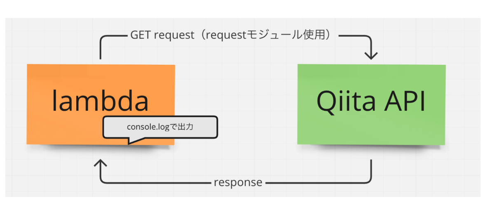
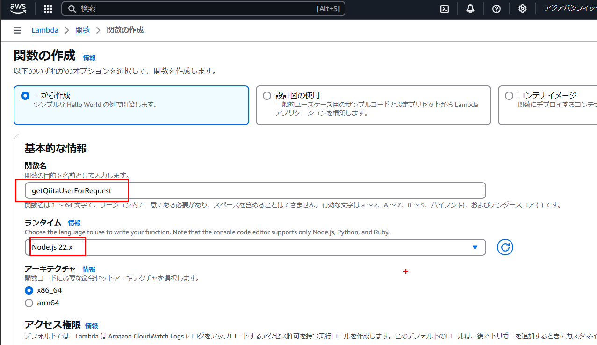
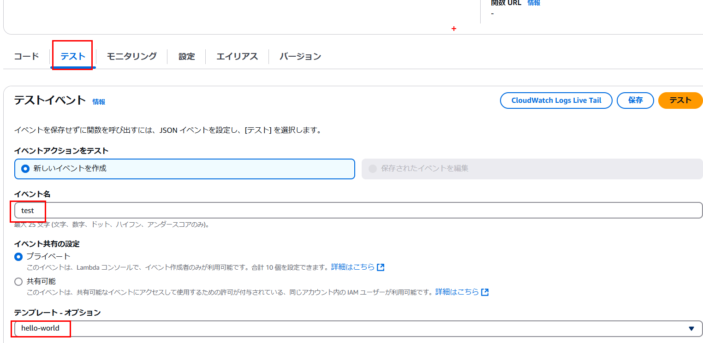
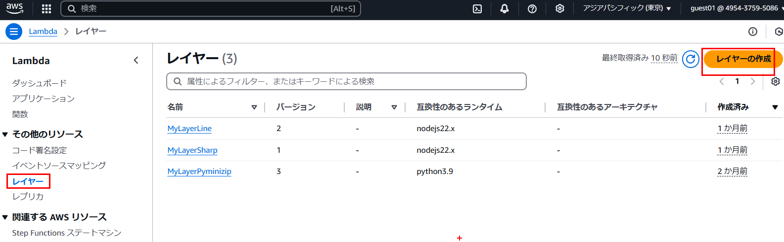
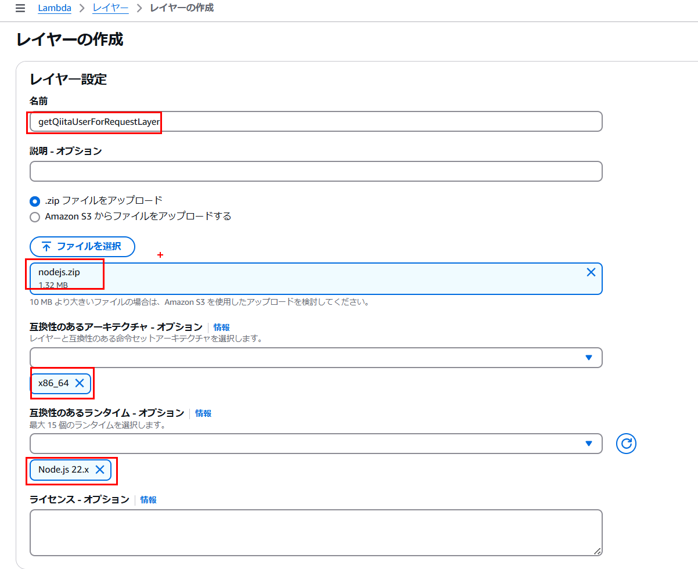
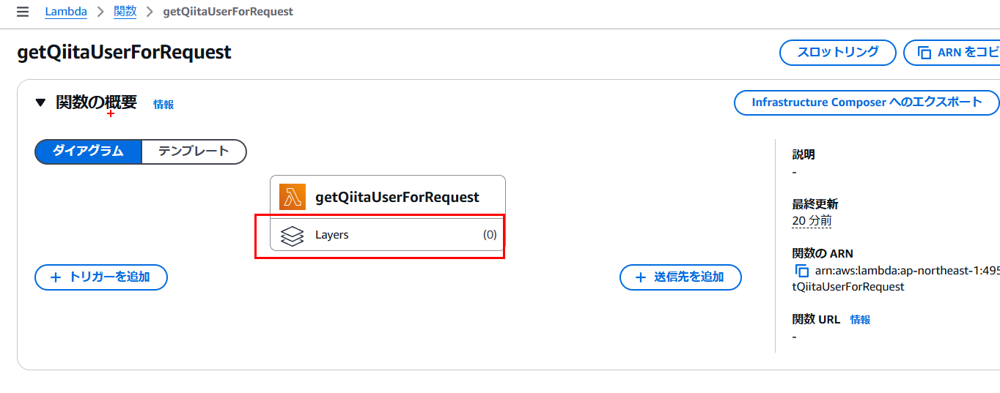
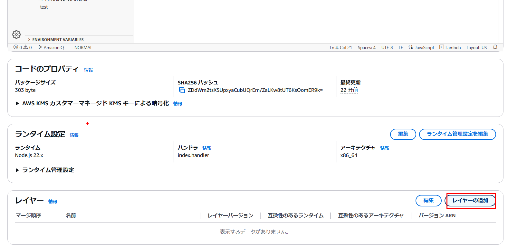
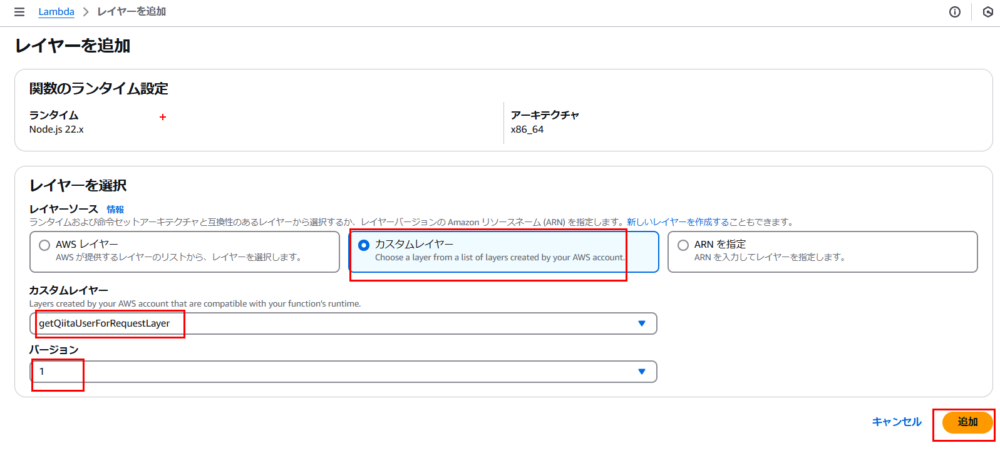
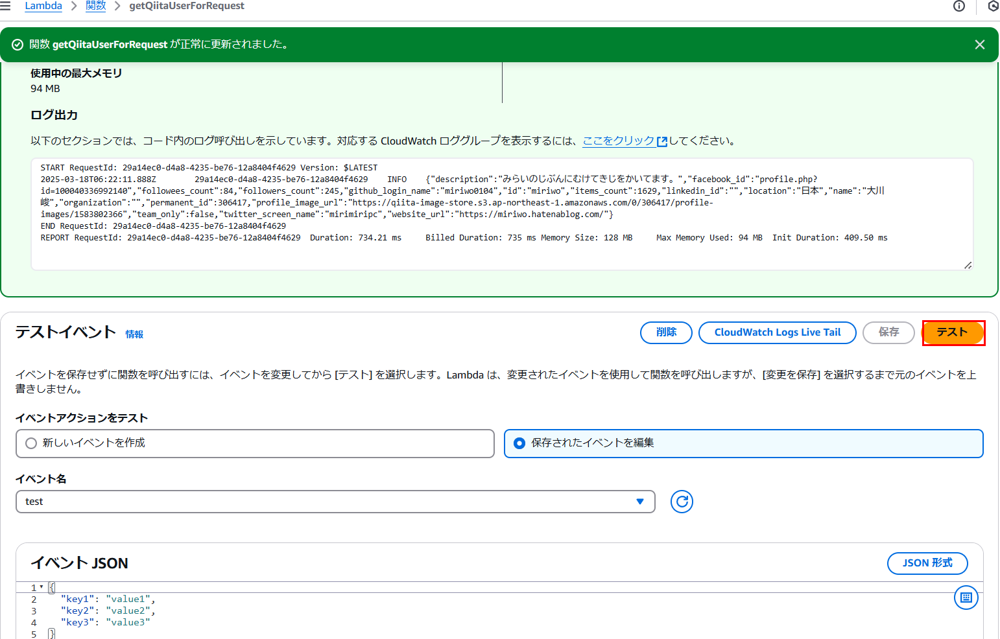

<h1>aws lambda layer追加</h1>

手動でlayerを追加



[AWS lambda Node\.jsの追加モジュールを使って他のAPIを実行してみる（requestモジュール使用 現在は非推奨） – ANTEKU CREATIVE BLOG](https://anteku.jp/blog/develop/aws-lambda-node-js%E3%81%AE%E8%BF%BD%E5%8A%A0%E3%83%A2%E3%82%B8%E3%83%A5%E3%83%BC%E3%83%AB%E3%82%92%E4%BD%BF%E3%81%A3%E3%81%A6%E4%BB%96%E3%81%AEapi%E3%82%92%E5%AE%9F%E8%A1%8C%E3%81%97%E3%81%A6/)

lambda作成


テスト


```js
import request from 'request';
const url = 'https://qiita.com/api/v2/users/miriwo';

const method = 'GET';
const options = {
    url: url,
    method: method,
};

export const handler = (event) => {
    request(options, function (error, response, body) {
        console.log(body);
    });  
};
```

追加モジュールの準備

```
nodejs $ npm init
::::::
package name: (nodejs)
version: (1.0.0)
description:
entry point: (index.js)
test command:
git repository:
keywords:
author:
license: (ISC)
:::
Is this OK? (yes)
::::::::
nodejs $  npm install request
:::::::::
practice-aws-lambda-manual-layer $ zip -r nodejs.zip nodejs/
```

レイヤーの作成

次は先に作成したnodejs.zipを使ってレイヤーを作成します。





レイヤーの設定






テスト実行
